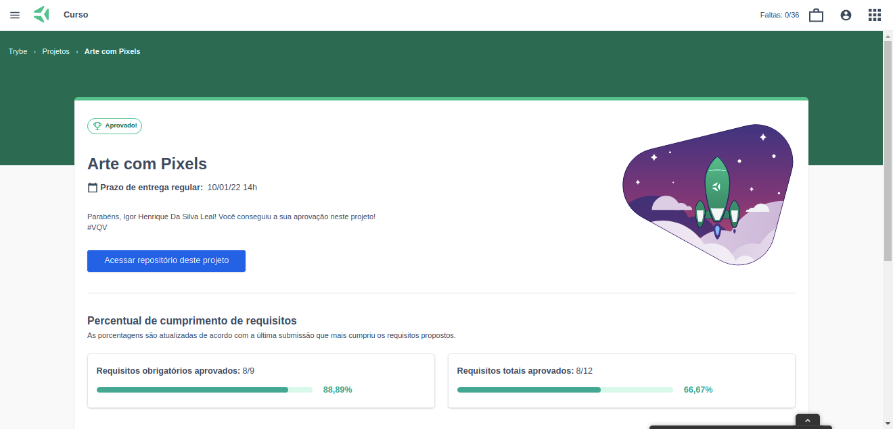

Esse projeto está desenvolvido utilizando HTML, CSS e JavaScript. Dos 9 requisitos obrigatórios, 8 já foram concluídos e os requisitos bônus ainda não foram iniciados.
O projeto foi iniciado ao final do Bloco 05 do Módulo de Fundamentos do Desenvolvimento Web da [Trybe](https://www.betrybe.com/).

Requisitos obrigatórios:

- *1 - Adicione à página o título `"Paleta de Cores"`:*

    - *O título deverá ficar dentro de uma tag `h1` com o id denominado `title`;*

    - *O texto do título deve ser exatamente `"Paleta de Cores"`;*

- *2 - Adicione à página uma paleta de quatro cores distintas:*

    - *A paleta de cores deve ser um elemento com id denominado `color-palette`, ao passo que cada cor individual contida na paleta de cores deve possuir a classe `color`;*

    - *A cor de fundo de cada elemento da paleta deverá ser a cor que o elemento representa. A única cor não permitida na paleta é a cor branca.;*

    - *Cada elemento da paleta de cores deverá ter uma borda preta, sólida e com 1 pixel de largura;*

    - *A paleta de cores deverá listar todas as cores disponíveis para utilização lado a lado, e deverá ser posicionada abaixo do título "Paleta de Cores";*

    - *A paleta de cores não deve conter cores repetidas;*

- *3 - Adicione na página a cor preta ela deve ser a primeira na paleta de cores:*

    - *Verifica se a primeira cor da paleta é preta;*

    - *Verifica se as demais cores podem ser escolhidas livremente;*

- *4 - Adicione à página um quadro de pixels, com 25 pixels:*

    - *O quadro de "pixels" deve ter 5 elementos de largura e 5 elementos de comprimento;*

    - *O quadro de "pixels" deve possuir o id denominado `pixel-board`, ao passo que cada "pixel" individual dentro do quadro deve possuir a classe denominada `pixel`;*

    - *A cor inicial dos "pixels" dentro do quadro, ao abrir a página, deve ser branca;*

    - *O quadro de "pixels" deve aparecer abaixo da paleta de cores;*

- *5 - Faça com que cada elemento do quadro de pixels possua 40 pixels de largura, 40 pixels de altura e seja delimitado por uma borda preta de 1 pixel:*

    - *Verifica se o quadro de pixels tem altura e comprimento de 5 elementos;*

    - *Verifica se 40 pixels é o tamanho total do elemento, incluindo seu conteúdo e excluindo a borda preta, que deve ser criada à parte;*

- *6 - Definia a cor preta como cor inicial. Ao carregar a página a cor preta já deve estar selecionada para pintar os pixels:*

    - *O elemento da cor preta deve possuir, inicialmente, a classe `selected`;*

    - *Note que o elemento que deverá receber a classe `selected` deve ser um dos elementos que possuem a classe `color`, como especificado no requisito 2;*

- *7 - Selecione uma das cores da paleta, ao clicar, a cor selecionada é a que será utilizada para preencher os pixels no quadro:*

    - *A classe `selected` deve ser adicionada à cor selecionada na paleta, ao mesmo tempo em que é removida da cor anteriormente selecionada;*

    - *Somente uma das cores da paleta deve ter a classe `selected` de cada vez;*

    - *Note que os elementos que deverão receber a classe `selected` devem ser os mesmos elementos que possuem a classe `color`, como especificado no requisito 2.*

- *8 - Clicar em um pixel dentro do quadro após selecionar uma cor na paleta, faz com que o pixel seja preenchido com a cor selecionada:*

    - *Verifica se ao carregar a página deve ser possível pintar os pixels de preto;*

    - *Verifica se após selecionar uma outra cor na paleta, é possível pintar os pixels com essa cor;*

    - *Verifica se somente o pixel que foi clicado foi preenchido com a cor selecionada, sem influenciar na cor dos demais pixels;*

- *9 - Crie um botão que, ao ser clicado, limpa o quadro preenchendo a cor de todos seus pixels com branco:*

    - *Verifica se o botão tem o id denominado clear-board;*

    - *Verifica se o botão está posicionado entre a paleta de cores e o quadro de pixels;*

    - *Verifica se o texto do botão é 'Limpar';*

    - *Verifica se ao clicar no botão, o quadro de pixels é totalmente preenchido de branco;*

Requisitos bônus:

- *10 - Faça o quadro de pixels ter seu tamanho definido pelo usuário:*

    - *Crie um input e um botão que permitam definir um quadro de pixels com tamanho entre 5 e 50. Ao clicar no botão, deve ser gerado um quadro de N pixels de largura e N pixels de altura, onde N é o número inserido no input;*

    - *Ou seja, se o valor passado para o input for 7, ao clicar no botão, vai ser gerado um quadro de 49 pixels (7 pixels de largura x 7 pixels de altura);*

    - *O input deve ter o id denominado board-size e o botão deve ter o id denominado generate-board;*

    - *O input só deve aceitar número maiores que zero. Essa restrição deve ser feita usando os atributos do elemento input;*

    - *O botão deve conter o texto "VQV";*

    - *O input deve estar posicionado entre a paleta de cores e o quadro de pixels;*

    - *O botão deve estar posicionado ao lado do input;*

    - *Se nenhum valor for colocado no input ao clicar no botão, mostre um alert com o texto: "Board inválido!";*

    - *O novo quadro deve ter todos os pixels preenchidos com a cor branca.*

- *11 - Limite o tamanho do mínimo e máximo do board:*

    - *Caso o valor digitado no input board-size fuja do intervalo de 5 a 50, faça:*

        - *Valor menor que 5, considerar 5 como padrão;*

        - *Valor maior que 50, considerar 50 como padrão;*

- *12 - Faça com que as cores da paleta sejam geradas aleatoriamente ao carregar a página:*

    - *A cor preta ainda precisa estar presente e deve ser a primeira na sua paleta de cores.*