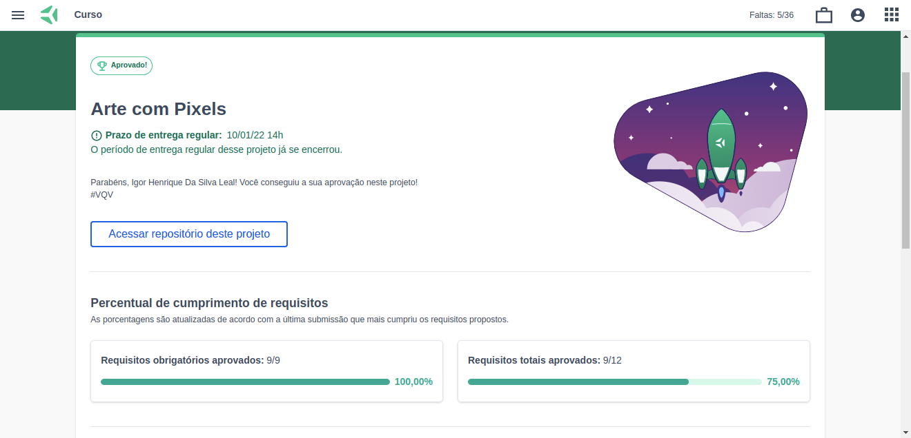

## Projeto Pixels Art

Esse projeto foi desenvolvido utilizando HTML, CSS e JavaScript. Os 9 requisitos obrigatórios foram concluídos e os requisitos bônus ainda não foram iniciados.
O projeto foi iniciado ao final do Bloco 05 do Módulo de Fundamentos do Desenvolvimento Web da [Trybe](https://www.betrybe.com/).

As linguagens utilizadas foram HTML e CSS para posicionamento e estilização dos elementos e JavaScript para a interação do usuário.

